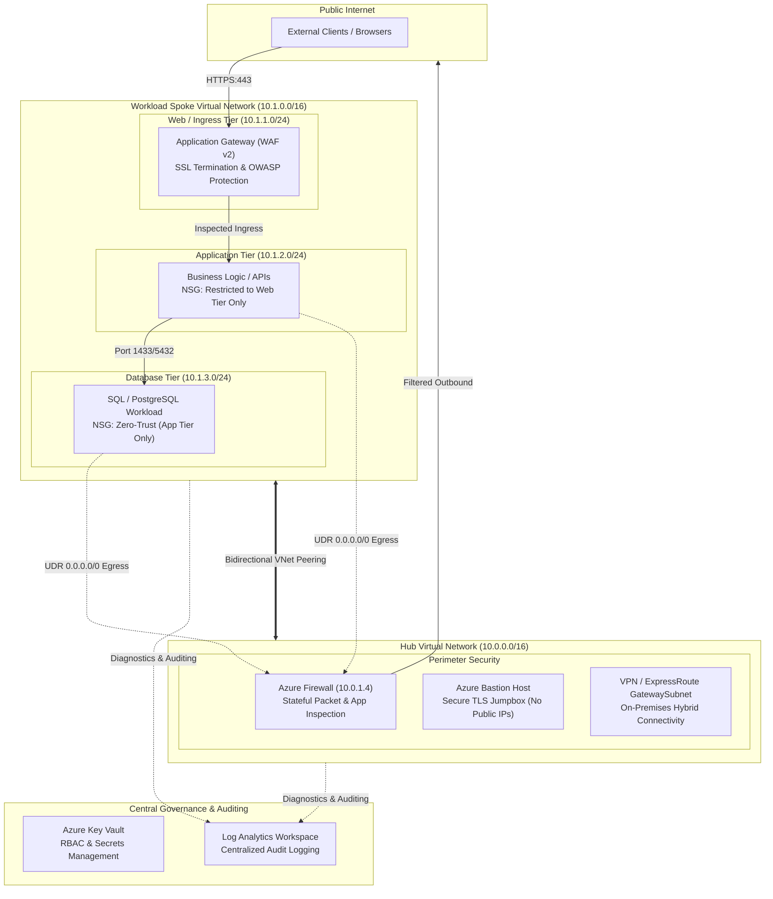

# Enterprise Azure Infrastructure (Hub-and-Spoke Architecture)

[](https://www.terraform.io/)
[](https://azure.microsoft.com/)
[](LICENSE)
[](https://aakashtrivedi-01.github.io/Cloud_portfolio_Aakash/)

---

## 1. What This Repository Is

In standard cloud setups, servers are often placed into a single flat network where every virtual machine can talk directly to the public internet. This creates a large attack surface, exposes databases, and makes security auditing difficult.

This repository provisions an automated, enterprise-grade **Hub-and-Spoke Network Architecture** on Microsoft Azure using Terraform. It isolates workloads, inspects all incoming and outgoing internet traffic through a central security hub, and provides centralized secrets management and audit logging.

* **Centralized Egress Control**: No backend system can communicate with the internet directly.
* **Layered Defense-in-Depth**: Strict micro-segmentation across Web, Application, and Database tiers.
* **Immutable Security Governance**: Centralized secrets storage and unified log streaming to satisfy enterprise security and compliance standards.

---

## 2. Core Concepts & Cloud Basics

If you are new to cloud networking or Infrastructure as Code (IaC), here are the fundamental concepts behind this architecture:

* **Hub-and-Spoke Topology**: Think of this like an airport. The **Hub** is the central terminal handling customs, security checkpoints, and baggage routing. The **Spokes** are the passenger gates hosting workloads in isolation.
* **Virtual Network (VNet) Peering**: Directly connects two Azure VNets over Microsoft's high-speed private backbone network. Traffic travels across private IP addresses without ever touching the public internet.
* **User-Defined Routes (UDR / Route Tables)**: Virtual routing tables that override Azure's default routing behavior. In this design, UDRs act like highway detours, forcing all outbound traffic from spoke subnets to run through the central Azure Firewall instead of routing straight to the web.
* **Network Security Groups (NSGs)**: Subnet-level packet firewalls containing stateful access rules (allow/deny) based on source IP, destination IP, port number, and protocol.
* **Application Gateway (WAF v2)**: A Layer 7 reverse proxy and load balancer. It terminates client HTTPS connections and runs Web Application Firewall rules to block common exploits like SQL Injection (SQLi) and Cross-Site Scripting (XSS).
* **Azure Bastion**: A managed PaaS jumpbox. It allows administrators to securely SSH (Linux) or RDP (Windows) into backend VMs via a browser using TLS on port 443, eliminating the need to assign public IPs to virtual machines.
* **Infrastructure as Code (IaC) with Terraform**: Writing your cloud infrastructure as declarative code files rather than clicking manually in the Azure Portal, guaranteeing consistent, repeatable, and version-controlled deployments.

---

## 3. Architecture Diagram



---

## 4. How the Architecture Works (Component-by-Component)

### A. The Hub Network (Central Connectivity & Inspection)
The Hub VNet acts as the single gateway for all traffic entering, leaving, or transiting the cloud environment.

* **Azure Firewall (`10.0.1.4`)**: Deployed into a dedicated `AzureFirewallSubnet`. It acts as a Layer 3–Layer 7 stateful inspection engine. Every outbound packet from the spoke is forwarded to this IP, enabling administrators to enforce FQDN allowlisting (e.g., allow `*.ubuntu.com` for OS updates) and prevent malicious data exfiltration.
* **Azure Bastion**: Hosted in `AzureBastionSubnet` to provide browser-based SSH/RDP access over HTTPS. Engineers can manage virtual machines without ever attaching a public IP directly to a VM.
* **Gateway Subnet**: Dedicated CIDR block reserved for future VPN or ExpressRoute gateways to support hybrid cloud connectivity to on-premises data centers.

### B. The Workload Spoke Network (Micro-Segmentation)
The Spoke VNet contains the application workloads and is segmented into three tiers:

* **Web Tier (`10.1.1.0/24`)**:
  * Runs the Azure Application Gateway (WAF v2).
  * Terminates inbound client TLS/SSL connections and inspects HTTP/HTTPS traffic against OWASP Top 10 vulnerabilities before forwarding traffic downstream.
* **Application Tier (`10.1.2.0/24`)**:
  * Runs application services and APIs.
  * Protected by an NSG configured to accept inbound traffic *only* from the Web Tier subnet.
* **Database Tier (`10.1.3.0/24`)**:
  * Runs persistent databases (SQL, PostgreSQL, etc.).
  * Operates on a zero-trust model: accepts inbound traffic *only* on database ports (e.g., 1433, 5432) originating exclusively from the Application Tier subnet.

### C. Traffic Flow & Routing Mechanics
* **Inbound Flow**: External clients reach the public IP of the Application Gateway on HTTPS (443). After decrypting and inspecting requests, the gateway forwards packets over private peering to backend App Tier VMs.
* **Internal East-West Flow**: The Application Tier queries the Database Tier directly across private subnets inside the Spoke VNet.
* **Outbound Egress Flow (UDR Enforced)**: Workloads do not use default Azure routing. A custom User-Defined Route forces all outbound traffic (`0.0.0.0/0`) to the Azure Firewall (`10.0.1.4`). The firewall validates the destination against allowlists before routing to the internet.

### D. Governance & Auditing
* **Azure Key Vault**: Stores certificates, keys, and connection strings. Access is governed via Azure RBAC with 7-day soft-delete protection enabled to guard against accidental deletion.
* **Log Analytics Workspace**: Serves as the central logging sink. Diagnostic logs from the Firewall, Application Gateway, and Network Security Groups stream here in real time for auditing and threat analysis.

---

## 5. Engineering Challenges & Solutions

### 1. Asymmetric Routing on Ingress Traffic
* **The Basic Concept**: When network packets leave via a different path than the one they entered, intermediate stateful firewalls drop the connection because they never saw the opening handshake.
* **The Problem**: A global default route (`0.0.0.0/0 -> Azure Firewall`) applied to all subnets broke incoming web requests. The Application Gateway received external traffic on its public IP, but its return packets followed the default route to the Azure Firewall instead of going straight back to the client.
* **Solution**: Separated route tables. The Application Gateway subnet was given a route table allowing direct internet egress (Internet next hop), while the backend App and Database subnets were assigned strict route tables pointing to the firewall.

### 2. Provider Argument Deprecation Warnings
* **The Basic Concept**: As Terraform providers evolve, configuration parameters are renamed or deprecated to support newer Azure APIs.
* **The Problem**: Running `terraform plan` returned deprecation warnings stating that `disable_bgp_route_propagation` is superseded by `bgp_route_propagation_enabled` and slated for removal in AzureRM v4.0.
* **Solution**: Updated the route table resource to `bgp_route_propagation_enabled = false` and pinned provider version constraints inside `versions.tf` to ensure reproducible pipeline runs.

### 3. Circular Dependencies & Race Conditions in VNet Peering
* **The Basic Concept**: Terraform calculates a dependency graph before creating resources. If Resource A requires Resource B, but Resource B also requires Resource A, Terraform cannot determine what to deploy first.
* **The Problem**: Configuring bidirectional VNet peering directly inside individual VNet modules caused a dependency loop (`module.hub -> module.spoke -> module.hub`), resulting in race conditions where peering failed before subnets fully resolved.
* **Solution**: Extracted peering into an independent module (`04-vnet-peering`) executed after both network modules complete. Added explicit `depends_on` constraints to ensure both VNets exist in state before peering begins.

### 4. Zero-Trust NSG Blocking Health Probes
* **The Basic Concept**: Load balancers and reverse proxies send continuous health checks ("ping" probes) to backend servers to verify they are alive before sending user traffic.
* **The Problem**: Applying aggressive Deny-All-Inbound rules on Web and App subnets inadvertently blocked health probes, causing the Application Gateway to mark all backend servers as unhealthy.
* **Solution**: Configured high-priority inbound allow rules for the `AzureLoadBalancer` service tag and allowed ports `65200-65535` for the `GatewayManager` infrastructure tag before applying default deny rules.

---

## 6. How to Deploy (Quickstart)

```bash
# 1. Clone the repository
git clone https://github.com/AAKASHTRIVEDI-01/Enterprise-Azure-Infrastructure.git
cd Enterprise-Azure-Infrastructure/terraform

# 2. Log in to Azure
az login

# 3. Initialize and inspect execution plan
terraform init
terraform plan

# 4. Deploy resources
terraform apply -auto-approve

# 5. Destroy resources after testing to avoid charges
terraform destroy -auto-approve
```

---

## Author

**Aakash Trivedi**  
Azure Cloud Engineer & Infrastructure Specialist  
* **AZ-104 Certified**: Microsoft Certified Azure Administrator Associate  
* **Portfolio**: [https://aakashtrivedi-01.github.io/Cloud_portfolio_Aakash/](https://aakashtrivedi-01.github.io/Cloud_portfolio_Aakash/)  
* **LinkedIn**: [linkedin.com/in/aakashtrivedi1003](https://linkedin.com/in/aakashtrivedi1003)  
* **GitHub**: [@AAKASHTRIVEDI-01](https://github.com/AAKASHTRIVEDI-01)