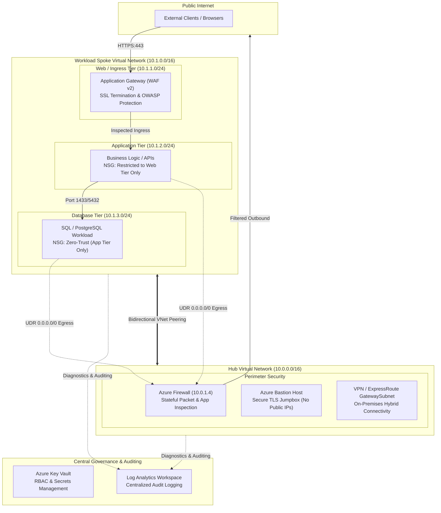

# Enterprise Azure Infrastructure (Hub-and-Spoke Architecture)

[](https://www.terraform.io/)
[](https://azure.microsoft.com/)
[](LICENSE)
[](https://aakashtrivedi-01.github.io/Cloud_portfolio_Aakash/)

Production-grade Infrastructure as Code (IaC) repository implementing an enterprise **Hub-and-Spoke Network Architecture** on Microsoft Azure. Features centralized perimeter inspection with Azure Firewall, Layer 7 WAF ingress with Application Gateway, network segmentation across multi-tier subnets, User-Defined Routes (UDR), Key Vault secrets governance, and centralized log auditing.

---

## Architecture Diagram



---

## Architectural Highlights

1. **Hub-and-Spoke Isolation**:
   - The **Hub VNet** acts as the central connectivity point for on-premises networks and external ingress/egress.
   - The **Spoke VNet** houses application workloads and is isolated from direct internet access.
   - Connected via bidirectional **VNet Peering** with forwarded traffic enabled.

2. **Perimeter Defense-in-Depth**:
   - **Layer 7 Ingress**: Azure Application Gateway (WAF v2) inspects incoming web traffic against OWASP Top 10 vulnerabilities.
   - **Layer 3-4 & Layer 7 Egress**: Azure Firewall centralizes all outbound traffic, preventing data exfiltration and enforcing strict domain allowlists (`*.microsoft.com`, `*.ubuntu.com`).

3. **Zero-Trust Network Routing (UDR)**:
   - User Defined Route tables assign `0.0.0.0/0` with next hop `VirtualAppliance` pointing directly to the Azure Firewall private IP.
   - Spoke workloads cannot bypass the firewall to access the internet directly.

4. **Multi-Tier Network Security Groups (NSGs)**:
   - **Web Tier**: Allows public HTTP/HTTPS and Azure GatewayManager health probes.
   - **App Tier**: Accepts connections *only* from the Web Tier subnet; blocks direct internet access.
   - **Database Tier**: Accepts database connections *only* from the App Tier subnet; blocks all other traffic.

5. **Secrets & Observability**:
   - **Azure Key Vault**: Stores connection strings and certificates with Azure RBAC and 7-day soft-delete protection.
   - **Log Analytics Workspace**: Centralized repository capturing diagnostic logs from the Firewall, Gateway, and network resources.

---

## Repository Structure

For a comprehensive explanation of every file and how they interact, see [FILE_EXPLANATION.md](FILE_EXPLANATION.md).

```text
├── FILE_EXPLANATION.md          # Exhaustive guide explaining what every file does
├── README.md                    # This document
├── .gitignore                   # Ignores Terraform state files and credentials
├── .github/
│   └── workflows/
│       └── terraform-ci.yml     # Automated linting and validation on GitHub Actions
├── scripts/
│   ├── deploy.ps1               # Automated deployment script for PowerShell
│   └── destroy.ps1              # Safe resource teardown script
└── terraform/
    ├── versions.tf              # Provider constraints and backend configuration
    ├── variables.tf             # Input parameters with sensible defaults
    ├── terraform.tfvars.example # Sample variable overrides
    ├── outputs.tf               # Exported resource IDs, IPs, and endpoints
    ├── main.tf                  # Root orchestrator invoking all modules
    └── modules/
        ├── 01-resource-group/   # Resource Group lifecycle management
        ├── 02-hub-network/      # Hub VNet, AzureFirewallSubnet, AzureBastionSubnet
        ├── 03-spoke-network/    # Spoke VNet with Web, App, and Data subnets
        ├── 04-vnet-peering/     # Bidirectional VNet peering
        ├── 05-firewall/         # Azure Firewall & firewall policies
        ├── 06-nsg-and-routing/  # UDR route tables and tier-specific NSG rules
        ├── 07-app-gateway/      # Application Gateway with WAF v2
        ├── 08-keyvault/         # Azure Key Vault with RBAC authorization
        └── 09-monitoring/       # Log Analytics Workspace
```

---

## Prerequisites

- [Azure CLI](https://learn.microsoft.com/en-us/cli/azure/install-azure-cli) (`>= 2.50.0`)
- [Terraform](https://developer.hashicorp.com/terraform/install) (`>= 1.5.0`)
- An active Microsoft Azure Subscription with Owner or Contributor + User Access Administrator roles.

---

## Quickstart Deployment Guide

### Step 1: Clone the Repository
```bash
git clone https://github.com/AAKASHTRIVEDI-01/azure-infra.git
cd azure-infra/terraform
```

### Step 2: Authenticate to Azure
```bash
az login
az account set --subscription "<YOUR_SUBSCRIPTION_ID_OR_NAME>"
```

### Step 3: Configure Variables
```bash
cp terraform.tfvars.example terraform.tfvars
# Open terraform.tfvars and customize your location, prefix, or CIDR blocks if desired
```

### Step 4: Initialize and Validate
```bash
terraform init
terraform fmt -check
terraform validate
```

### Step 5: Review Execution Plan (No Cloud Charges Incurred)
```bash
terraform plan
```

### Step 6: Deploy Infrastructure
```bash
terraform apply
# Type 'yes' when prompted to create resources
```

---

## Teardown & Cost Cleanup

To prevent ongoing cloud charges when finished testing, run:

```bash
cd terraform
terraform destroy -auto-approve
```

Alternatively, use the automated cleanup helper:
```powershell
.\scripts\destroy.ps1
```

---

## Author

**Aakash Trivedi**  
Azure Cloud Engineer & Infrastructure Specialist  
- **AZ-104 Certified**: Microsoft Certified Azure Administrator Associate  
- **Portfolio**: [https://aakashtrivedi-01.github.io/Cloud_portfolio_Aakash/](https://aakashtrivedi-01.github.io/Cloud_portfolio_Aakash/)  
- **LinkedIn**: [linkedin.com/in/aakashtrivedi1003](https://linkedin.com/in/aakashtrivedi1003)  
- **GitHub**: [@AAKASHTRIVEDI-01](https://github.com/AAKASHTRIVEDI-01)
